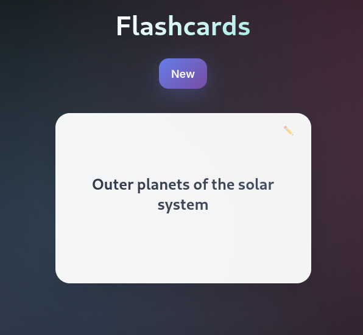
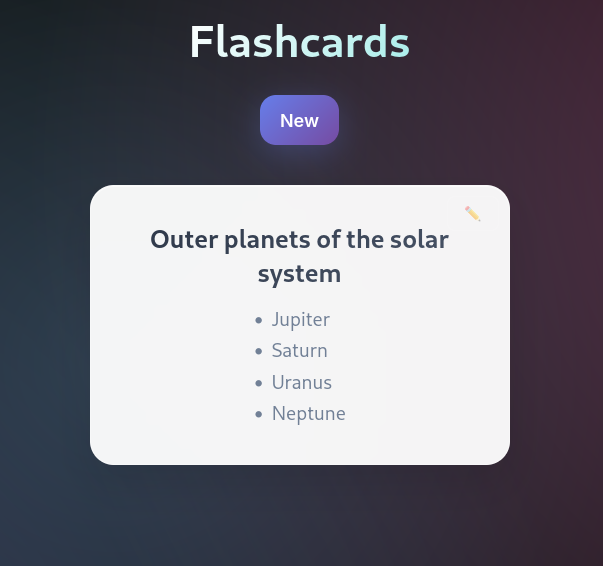
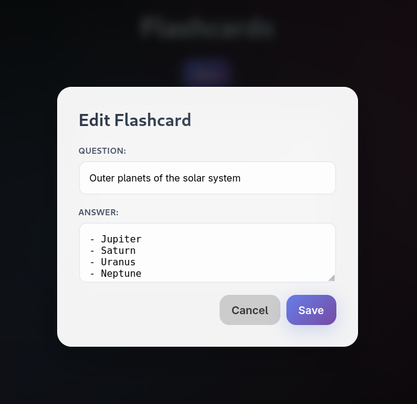

# Flashcard app

**THIS IS A VIBE-CODED app made with Claude. I DID NOT REVIEW ALL THE CODE BUT EVERY TIME I LOOK AT SOMETHING I FIND A CRITICAL OWASP TOP 10 VULNERABILITY IN IT. DO NOT PUT THIS ON THE OPEN INTERNET. IT SHOULD RUN STRICTLY ON A CONTAINER, BE SINGLE USER (YOU) AND BE PROTECTED BEHIND AN AUTH PROXY THAT IS PROPERLY CONFIGURED.**

Very simple self-hosted flashcard app. I built it for my personal use, but it might be useful to others as well.

- The flashcards are stored in the `data/cards.json` file
- There is a very simple python backend to serve the UI, the flashcards and update the cards
- There is now markdown support for the answers.

All of the features can be demonstrated with these 3 screenshots:

NOTES:
-  authentication/Authorization are not handled by the application. It is designed to be served by
a proxy like [Caddy security](https://github.com/greenpau/caddy-security) or [oauth2-proxy](https://github.com/oauth2-proxy/oauth2-proxy).
- The UI was generated by Claude, which for once had the good taste of not overcomplicating things with React and Npm.
But the css is a bit of a mess.
