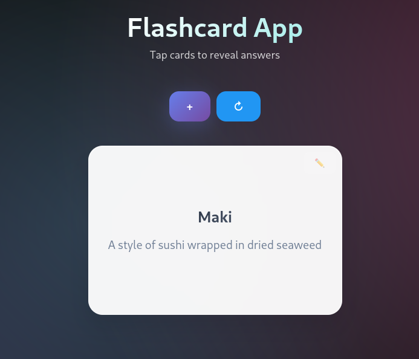

# Flashcard app

Very simple self-hosted flashcard app. I built it for my personal use, but it might be useful to others as well.

- The flashcards are stored in the `data/cards.json` file
- There is a very simple python backend to serve the UI, the flashcards and update the cards

NOTE: authentication/Authorization are not handled by the application. It is designed to be served by
a proxy like [Caddy security](https://github.com/greenpau/caddy-security) or [oauth2-proxy](https://github.com/oauth2-proxy/oauth2-proxy).
